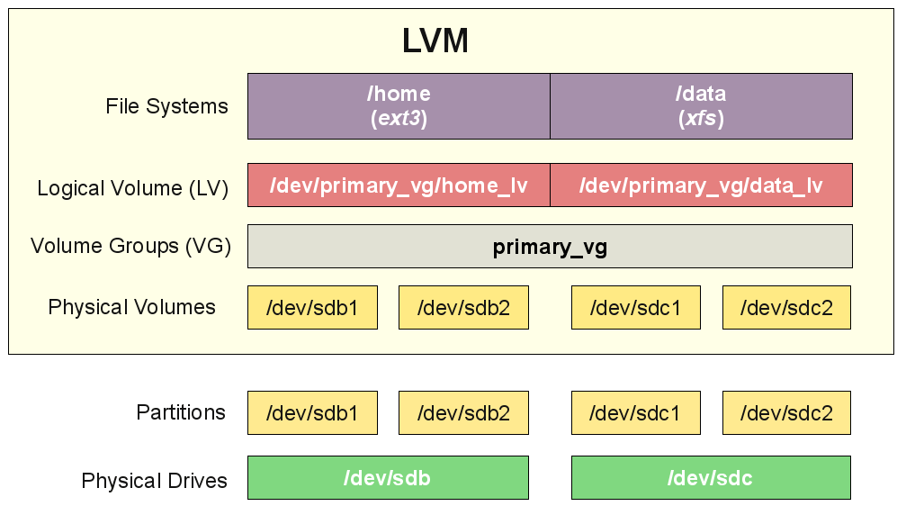

# LVM Disks

- [LVM Disks](#lvm-disks)
  - [Detect new Hard Disks](#detect-new-hard-disks)
  - [Create new partition](#create-new-partition)
  - [LVM order of execution](#lvm-order-of-execution)
  - [Extend LVs in LVM](#extend-lvs-in-lvm)

## Detect new Hard Disks

In order to detect new attached Hard Disks without rebooting the system try the following one-line script:

```bash
echo 1 > /sys/block/sda/device/rescan && for host in /sys/class/scsi_host/*; do echo "- - -" | sudo tee $host/scan; ls /dev/sd* ; done
```

**Tip**: This task can be done in a more efficient manner by using Ansible Adhoc command:

```bash
ansible <group_name> -a 'echo 1 > /sys/block/sda/device/rescan && for host in /sys/class/scsi_host/*; do echo "- - -" | sudo tee $host/scan; ls /dev/sd* ; done' -i inventories/<environment>/hosts.yml --become
```

For example:

```bash
# ansible all -a 'echo 1 > /sys/block/sda/device/rescan && for host in /sys/class/scsi_host/*; do echo "- - -" | sudo tee $host/scan; ls /dev/sd* ; done' -i inventories/development/hosts.yml --become
```

## Create new partition

In case the Infrastructure team attached the new disk(s) on the same SCSI disk, it is required to create new partition for the disk, in order to extend it in next steps.

```bash
fdisk /dev/<SCSI_DISK_NAME>  # fdisk /dev/sda
```

Check the free unpartitioned space of the SCSI disk to ensure that the right disk is selected (by passing `F` as an argument to fdisk command). Then, create a new partition by passing `n` argument to it. Finally, you can print the partition table (by passing `p` to fdisk command) and write table to disk, if everything is OK (by passing `w` as an argument to fdisk command, otherwise enter `q` in order not to apply changes).

## LVM order of execution



The order of execution for LVM (Logical Volume Management) in Linux is as follows:

1. **Physical Volumes** (PVs): You can see the existing PVs on the host machine by executing `pvs` command.
2. **Volume Groups** (VGs): You can see the existing VGs on the host machine by executing `vgs` command.
3. **Logical Volumes** (LVs): You can see the existing LVs on the host machine by executing `lvs` command.

## Extend LVs in LVM

1. Create new PV:

    ```bash
    pvcreate <SCSI_DISK_NAME><PARTITION>  # pvcreate /dev/sda4
    ```

2. Extend the existing volume group:

    ```bash
    vgextend <volume_group_name>  # vgextend ubuntu-vg /dev/sda4
    ```

3. Extend the existing logical volume:

    ```bash
    lvextend -l +100%FREE /dev/<volume_group_name>/<logical_volume_name>  # lvextend -l +100%FREE /dev/ubuntu-vg/ubuntu-lv
    ```

4. Resize the filesystem in order to apply changes:

    ```bash
    resize2fs <volume_group_name>/<logical_volume_name>  # resize2fs /dev/ubuntu-vg/ubuntu-lv
    ```
